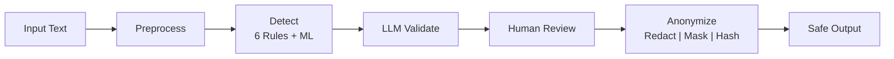

# PII Shield

**German PII Detection & De-identification**

A production-ready service that detects and anonymizes Personally Identifiable Information, with special focus on **German data formats** and support for **GDPR anonymization techniques**.

---

## Pipeline Overview



The pipeline processes text through six stages: preprocessing, multi-detector scanning (6 rule-based + ML), LLM validation for ambiguous cases, confidence-based human review, and finally applies the chosen anonymization strategy.

---

## Detection Layer

The system uses 8 specialized detectors combining rule-based validation with ML-powered entity recognition:

| Detector | Type | Validation Method | Confidence |
|----------|------|-------------------|------------|
| Email | Rule-based | RFC 5322 pattern matching | 1.0 |
| Phone | Rule-based | German formats (+49, 0xxx) | 0.8-1.0 |
| IBAN | Rule-based | **MOD-97 checksum** | 0.7-1.0 |
| German ID | Rule-based | **Check digit algorithm** | 0.6-1.0 |
| Credit Card | Rule-based | **Luhn algorithm** | 1.0 |
| IP Address | Rule-based | IPv4/IPv6 validation | 1.0 |
| Names | ML (Presidio) | German spaCy NER model | 0.7-0.95 |
| Addresses | ML (Presidio) | German spaCy NER model | 0.7-0.95 |

---

## German PII Validation

This is what differentiates PII Shield for German/EU data protection compliance.

### IBAN Validation (MOD-97)

German IBANs are validated using the ISO 7064 MOD-97 algorithm:

```python
def validate_iban_checksum(iban: str) -> bool:
    # 1. Move first 4 chars to end
    rearranged = iban[4:] + iban[:4]

    # 2. Convert letters to numbers (A=10, B=11, ..., Z=35)
    numeric = ""
    for char in rearranged:
        if char.isalpha():
            numeric += str(ord(char.upper()) - 55)
        else:
            numeric += char

    # 3. Valid if mod 97 == 1
    return int(numeric) % 97 == 1
```

| Example | Result |
|---------|--------|
| `DE89370400440532013000` | Valid (checksum passes) |
| `DE00370400440532013000` | Detected but invalid checksum |

### Personalausweis (German ID Card)

German ID numbers use a weighted check digit algorithm:

```python
WEIGHTS = (7, 3, 1, 7, 3, 1, 7, 3, 1)

def validate_german_id(id_number: str) -> bool:
    total = 0
    for i, char in enumerate(id_number[:-1]):
        value = int(char) if char.isdigit() else ord(char.upper()) - 55
        total += value * WEIGHTS[i % 9]

    return (total % 10) == int(id_number[-1])
```

| Format | Example |
|--------|---------|
| 9-10 alphanumeric characters | `L01X00T471` |
| Valid prefixes: L, M, N, P, R, T, V, W, X, Y | `T22000129D` |

### German Phone Numbers

| Format | Pattern | Example |
|--------|---------|---------|
| International | `+49 xxx xxxxxxx` | +49 30 12345678 |
| International (alt) | `0049 xxx xxxxxxx` | 0049 171 1234567 |
| National | `0xxx xxxxxxx` | 030 12345678 |
| Mobile | `015x-017x` prefixes | 0171 12345678 |
| Service | `0800`, `0180x` | 0800 1234567 |

---

## LLM Validation

An LLM validates ambiguous detections to reduce false positives:

- **High confidence detections (90%+)** are auto-approved
- **Lower confidence detections** are sent to LLM for validation

**Example disambiguation:**
- Input: "Müller GmbH" vs "Hans Müller"
- Rule-based: Both detected as NAME
- LLM validation: Rejects "Müller GmbH" (company name), confirms "Hans Müller" (person)

> **Note:** This demo uses Claude API for convenience. In production, sending PII to external APIs violates GDPR. A production deployment would use **on-premise LLMs** (e.g., SAP AI Core, local Llama models) to ensure data never leaves the organization.

---

## Human Review

Confidence-based triage system:

| Confidence Level | Action |
|------------------|--------|
| High (auto-approved) | No action needed |
| Low (needs review) | Human decides: Confirm PII or Reject |

---

## Anonymization Strategies

Three de-identification strategies:

| Strategy | Input | Output | Use Case |
|----------|-------|--------|----------|
| **Redaction** | `hans@sap.com` | `[EMAIL]` | Full anonymization |
| **Masking** | `hans@sap.com` | `han***com` | Partial visibility (debugging, logs) |
| **Hashing** | `hans@sap.com` | `a3f2b1c4` | Pseudonymization with salt (GDPR Art. 4) |

---

## Quick Start

```bash
# Clone and run
git clone https://github.com/omargawdat/SAP_DEMO.git
cd SAP_DEMO

# Start services
docker compose up --build

# Access:
# API:  http://localhost:8000/docs
# Demo: http://localhost:8501
```

**Test the API:**

```bash
curl -X POST http://localhost:8000/api/v1/detect \
  -H "Content-Type: application/json" \
  -d '{"text": "Contact hans@sap.com, IBAN: DE89370400440532013000"}'
```

---

## Tech Stack

| Category | Technologies |
|----------|--------------|
| **Core** | Python 3.13, FastAPI, Pydantic v2 |
| **ML** | Presidio, spaCy (German model) |
| **AI** | Claude API (Anthropic) |
| **Deploy** | Docker, AWS App Runner, AWS ECR |
| **Secrets** | AWS Secrets Manager, GitHub Secrets |
| **Quality** | pytest, ruff, pre-commit, GitHub Actions |
