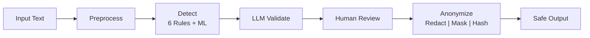

# PII Shield

## About Me

**Omar Mohamed** — Master's student in Software Engineering & ERP at Fachhochschule Südwestfalen (Hagen) with 2-3 years of professional experience. Background in Data Engineering and AI from bachelor's studies.

| | |
|---|---|
| **GitHub** | [github.com/omargawdat](https://github.com/omargawdat) |
| **Codeforces** | [codeforces.com/profile/Omar.Gawdat](https://codeforces.com/profile/Omar.Gawdat) |

## About This Project

Built to demonstrate my skills for the **Working Student - Provisioning of de-identification services** role at SAP EDT Data Protection team. This project showcases Python development, cloud deployment, ML integration, and German PII handling.

| | |
|---|---|
| **Live Demo** | [sap-pii-shield.streamlit.app](https://sap-pii-shield.streamlit.app) |
| **API Swagger** | [sap-pii-demo.omar-gawdat.com/docs](https://sap-pii-demo.omar-gawdat.com/docs) |
| **API Documentation** | [sap-pii-shield-omar.apidog.io](https://sap-pii-shield-omar.apidog.io) |
| **GitHub** | [github.com/omargawdat/SAP_DEMO](https://github.com/omargawdat/SAP_DEMO) |

---

## Pipeline Overview



The pipeline processes text through six stages: preprocessing, multi-detector scanning (6 rule-based + ML), LLM validation for ambiguous cases, confidence-based human review, and finally applies the chosen anonymization strategy.

---

## Detection Layer

The system uses 8 specialized detectors combining rule-based validation with ML-powered entity recognition:

| Detector | Type | Validation Method | Confidence |
|----------|------|-------------------|------------|
| Email | Rule-based | RFC 5322 pattern matching | 1.0 |
| Phone | Rule-based | German formats (+49, 0xxx) | 0.8-1.0 |
| IBAN | Rule-based | **MOD-97 checksum** | 0.7-1.0 |
| German ID | Rule-based | **Check digit algorithm** | 0.6-1.0 |
| Credit Card | Rule-based | **Luhn algorithm** | 1.0 |
| IP Address | Rule-based | IPv4/IPv6 validation | 1.0 |
| Names | ML (Presidio) | German spaCy NER model | 0.7-0.95 |
| Addresses | ML (Presidio) | German spaCy NER model | 0.7-0.95 |

---

## ML Detection (spaCy NER)

For context-dependent PII that regex cannot reliably detect, the system uses **Microsoft Presidio** with **spaCy German NER** (Named Entity Recognition):

| Component | Details |
|-----------|---------|
| **Framework** | Microsoft Presidio Analyzer |
| **NLP Engine** | spaCy |
| **Model** | `de_core_news_md` (German, 46MB) |
| **Processing** | 100% local - no data leaves the environment |

**Entities Detected:**

| Entity | Maps To | Example |
|--------|---------|---------|
| PERSON | NAME | "Hans Müller", "Angela Schmidt" |
| LOCATION | ADDRESS | "Hauptstraße 123", "10115 Berlin" |
| DATE_TIME | DATE_OF_BIRTH | "born on 15.03.1990" |

**Example Output:**

Input: `"Hans Müller wohnt in Berlin"`

| Detected | Type | Confidence |
|----------|------|------------|
| Hans Müller | NAME | 0.85 |
| Berlin | ADDRESS | 0.78 |

---

## LLM Validation

An LLM validates ambiguous detections to reduce false positives:

- **High confidence detections (90%+)** are auto-approved
- **Lower confidence detections** are sent to LLM for validation

**Example disambiguation:**
- Input: "Müller GmbH" vs "Hans Müller"
- Rule-based: Both detected as NAME
- LLM validation: Rejects "Müller GmbH" (company name), confirms "Hans Müller" (person)

:::warning
This demo uses Claude API for convenience. In production, sending PII to external APIs violates GDPR. A production deployment would use **on-premise LLMs** (e.g., SAP AI Core, local Llama models) to ensure data never leaves the organization.
:::

---

## Human Review

Confidence-based triage system:

| Confidence Level | Action |
|------------------|--------|
| High (auto-approved) | No action needed |
| Low (needs review) | Human decides: Confirm PII or Reject |

---

## Anonymization Strategies

Three de-identification strategies:

| Strategy | Input | Output | Use Case |
|----------|-------|--------|----------|
| **Redaction** | `hans@sap.com` | `[EMAIL]` | Full anonymization |
| **Masking** | `hans@sap.com` | `han***com` | Partial visibility (debugging, logs) |
| **Hashing** | `hans@sap.com` | `a3f2b1c4` | Pseudonymization with salt (GDPR Art. 4) |

---

## Quick Start

```bash
# Clone and run
git clone https://github.com/omargawdat/SAP_DEMO.git
cd SAP_DEMO

# Start services
docker compose up --build

# Access:
# API:  http://localhost:8000/docs
# Demo: http://localhost:8501
```

---

## Tech Stack

| Category | Technologies |
|----------|--------------|
| **Core** | Python 3.13, FastAPI, Pydantic v2 |
| **ML** | Presidio, spaCy (German model) |
| **AI** | Claude API (Anthropic) |
| **Deploy** | Docker, AWS App Runner, AWS ECR |
| **Secrets** | AWS Secrets Manager, GitHub Secrets |
| **Quality** | pytest, ruff, pre-commit, GitHub Actions |
