# PII Shield - Architecture Diagrams

## 1. High-Level System Architecture

---

## 2. Detection Pipeline Flow

```mermaid
flowchart LR
    subgraph Input
        A["Raw Text<br/>'Contact Hans at hans@sap.com'"]
    end

    subgraph Preprocessing
        B["Normalize Unicode<br/>Collapse Whitespace"]
    end

    subgraph Detection["Parallel Detection"]
        direction TB
        C1["📧 EmailDetector<br/>RFC 5322 Regex"]
        C2["📞 PhoneDetector<br/>German Formats"]
        C3["🏦 IBANDetector<br/>MOD-97 Checksum"]
        C4["🪪 GermanIDDetector<br/>Check Digit"]
        C5["💳 CreditCardDetector<br/>Luhn Algorithm"]
        C6["🌐 IPDetector<br/>IPv4/IPv6"]
        C7["🤖 PresidioDetector<br/>spaCy German NER"]
    end

    subgraph Aggregation
        D["Collect All Matches<br/>Sort by Position"]
    end

    subgraph Deduplication
        E["Group by (start, end)<br/>Keep Highest Confidence"]
    end

    subgraph Output
        F["List[PIIMatch]<br/>Ready for Strategy"]
    end

    A --> B --> Detection
    C1 & C2 & C3 & C4 & C5 & C6 & C7 --> D
    D --> E --> F

    style Input fill:#ffebee
    style Preprocessing fill:#fff8e1
    style Detection fill:#e3f2fd
    style Aggregation fill:#f3e5f5
    style Deduplication fill:#e8f5e9
    style Output fill:#e0f2f1
```

---

## 3. PIIMatch Data Model

---

## 4. Detector Class Hierarchy

---

## 5. Strategy Class Hierarchy

---

## 6. Human-in-the-Loop Workflow

```mermaid
flowchart TB
    subgraph Step1["Step 1: Input & Detection"]
        A[User Enters Text] --> B[Select LLM Model]
        B --> C[Set Confidence Threshold]
        C --> D["🔍 Analyze Text"]
        D --> E["/api/v1/detect"]
    end

    subgraph Step2["Step 2: Review & Approve"]
        E --> F{Confidence >= Threshold?}
        F -->|Yes| G["✅ Auto-Approved<br/>(High Confidence)"]
        F -->|No| H["⚠️ Needs Review<br/>(Low Confidence)"]
        H --> I{User Decision}
        I -->|Confirm| J["✓ Is PII"]
        I -->|Reject| K["✗ Not PII"]
        G --> L[Select Strategy]
        J --> L
    end

    subgraph Step3["Step 3: Anonymization"]
        L --> M["🛡️ Apply Strategy"]
        M --> N["/api/v1/anonymize"]
        N --> O["📄 Processed Text"]
        N --> P["📊 Analytics Report"]
    end

    style Step1 fill:#e3f2fd
    style Step2 fill:#fff3e0
    style Step3 fill:#e8f5e9
```

---

## 7. LLM Validation Flow

```mermaid
flowchart TB
    A[Detection Results] --> B{Split by Confidence}

    B -->|>= 90%| C["✅ Auto-Approved<br/>Skip LLM"]
    B -->|< 90%| D["⚠️ Low Confidence<br/>Send to LLM"]

    D --> E["Extract Sentences<br/>Group Matches"]
    E --> F["Batch 10 Sentences<br/>Per API Call"]
    F --> G["Claude API<br/>(haiku/sonnet/opus)"]

    G --> H{LLM Response}
    H -->|is_pii: true| I["✅ Validated<br/>Update Confidence"]
    H -->|is_pii: false| J["❌ Rejected<br/>False Positive"]

    C --> K[Final Matches]
    I --> K
    J --> L[Filtered Out]

    style C fill:#c8e6c9
    style I fill:#c8e6c9
    style J fill:#ffcdd2
    style L fill:#ffcdd2
```

---

## 8. API Request/Response Flow

---

## 9. Deployment Architecture

---

## 10. German PII Detection Examples

```mermaid
flowchart LR
    subgraph Input["German Text Examples"]
        T1["hans.mueller@sap.com"]
        T2["+49 30 12345678"]
        T3["DE89370400440532013000"]
        T4["L01X00T471"]
        T5["192.168.1.1"]
    end

    subgraph Detection["Detection & Validation"]
        D1["📧 Email<br/>RFC 5322 ✓"]
        D2["📞 Phone<br/>+49 Format ✓"]
        D3["🏦 IBAN<br/>MOD-97 ✓"]
        D4["🪪 German ID<br/>Check Digit ✓"]
        D5["🌐 IP Address<br/>IPv4 Valid ✓"]
    end

    subgraph Output["Redaction Output"]
        O1["[EMAIL]"]
        O2["[PHONE]"]
        O3["[IBAN]"]
        O4["[GERMAN_ID]"]
        O5["[IP_ADDRESS]"]
    end

    T1 --> D1 --> O1
    T2 --> D2 --> O2
    T3 --> D3 --> O3
    T4 --> D4 --> O4
    T5 --> D5 --> O5

    style Input fill:#ffebee
    style Detection fill:#e3f2fd
    style Output fill:#e8f5e9
```

---

## 11. Confidence Scoring System

```mermaid
flowchart TB
    subgraph Detectors["Detection Confidence"]
        E["Email: 1.0<br/>(Pattern match)"]
        P["Phone: 0.8-1.0<br/>(Format quality)"]
        I["IBAN: 0.7-1.0<br/>(Checksum valid?)"]
        G["German ID: 0.6-1.0<br/>(Check digit valid?)"]
        PR["Presidio: 0.0-1.0<br/>(NER confidence)"]
    end

    subgraph Threshold["Confidence Threshold"]
        T{">= 0.85?"}
    end

    subgraph Decision["Human-in-the-Loop"]
        HIGH["✅ Auto-Approve"]
        LOW["⚠️ Needs Review"]
    end

    subgraph LLM["Optional LLM Validation"]
        VAL["Claude validates<br/>context & semantics"]
        ADJ["Adjust confidence<br/>or reject"]
    end

    E & P & I & G & PR --> T
    T -->|Yes| HIGH
    T -->|No| LOW
    LOW --> VAL --> ADJ

    style HIGH fill:#c8e6c9
    style LOW fill:#fff3e0
    style LLM fill:#e3f2fd
```

---

## How to View These Diagrams

### Option 1: GitHub README
Copy any diagram to your `README.md` - GitHub renders Mermaid automatically.

### Option 2: Mermaid Live Editor
Visit [mermaid.live](https://mermaid.live) and paste the code.

### Option 3: VS Code Extension
Install "Mermaid Preview" extension for live rendering.

### Option 4: Export to PNG/SVG
Use mermaid-cli: `mmdc -i architecture.md -o diagram.png`
